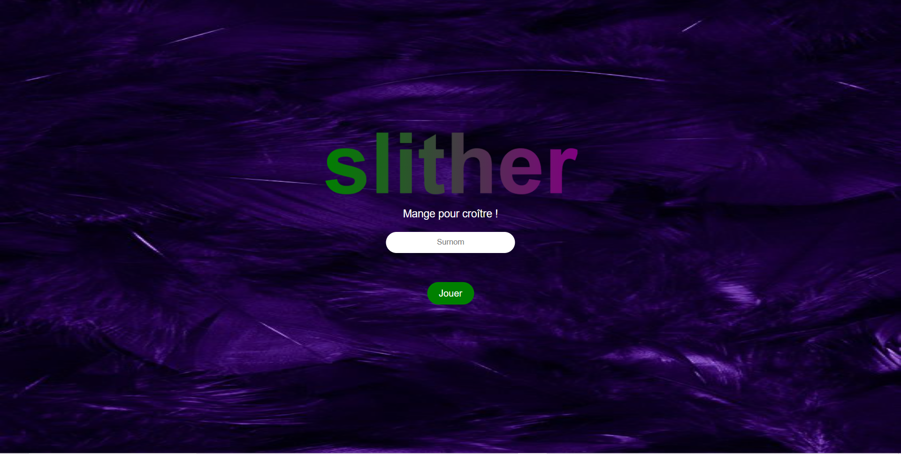
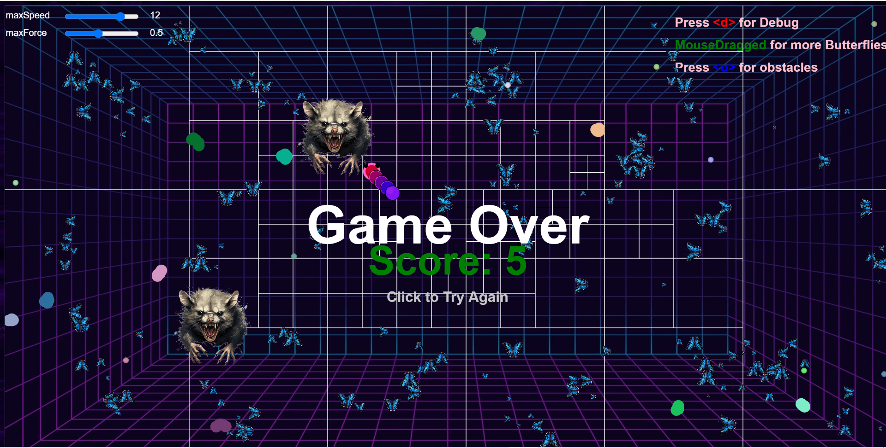
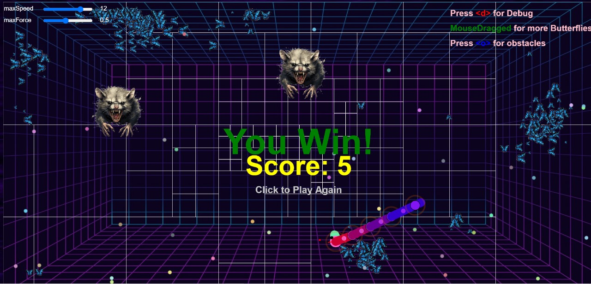

# 🐍🎮 Slither-Game  

**Slither-Game** est un jeu interactif inspiré du célèbre Slither.io, développé en HTML, CSS, et JavaScript. Ce projet utilise la bibliothèque [p5.js](https://p5js.org/) pour gérer les interactions graphiques et le comportement autonome. Réalisé dans le cadre de mon cours d'IA Réactive, il illustre l'application de concepts étudiés en classe pour créer une expérience de jeu immersive où le joueur contrôle un serpent tout en interagissant avec des ennemis autonomes, des mangoustes, et un environnement dynamique.  

---

## 🌟 Aperçu  

Dans **Slither-Game**, vous devrez :
- **Commencer par une page d'accueil** : Entrez votre pseudo pour personnaliser votre expérience et démarrer le jeu.    
- **Contrôler votre serpent** : Mangez des objets et des serpents ennemis pour grandir.  
- **Éviter les dangers** : Fuyez les mangoustes .**Astuces** vous pouvez utilisez des obstacles pour vous cacher.  
- **Survivre et triompher** : Mangez tous les serpents ennemis sans vous faire attraper par la mangouste pour gagner !  
- **Personnalisez et ajustez** : Modifiez la vitesse et la force de votre serpent à l’aide des sliders,le debug avec un d pour voir ce qui ce passe , creer les obstacles avec un o ou ajoutez des papillons avec un clic sur `mouseDragged`.  

## 🚀 Fonctionnalités Principales  
### 📋 **Page d'Accueil**  
- Une interface intuitive pour entrer votre pseudo avant de commencer le jeu. 


### 🐍 **Le Serpent Joueur**  
- **Croissance** : Grandit en mangeant de la nourriture ou des serpents ennemis.  
- **Effets spéciaux** :Devient brillant après avoir mangé un ennemi.  
- **Interactions avec l'environnement** : Peut se cacher derrière des obstacles créés avec la touche `O` (Les obtacles ont un etat de santé qui diminue apres chaque contacte avec le mangouste dès qu'il devient 0 l'obtacle sera détruit et oooops il te mange le mangouste ).  

### 🐍 **Les Serpents Ennemis**  
- Ils mangent aussi de la nourriture pour grandir.  
- Deviennent une cible que le joueur doit éliminer.  

### 🦴 **Les Mangoustes**  
- Elles tournent dans l’arène et traquent le serpent du joueur.  
- Peuvent détruire les obstacles pour attraper le joueur. 
 Si la mangouste attrape le serpent, c'est **Game Over**. 


### 🦋 **Les Papillons**
- Ils fuient (comportement **flee**) lorsqu’ils détectent le serpent du joueur. 
### 🏆 **Score et Victoire**  
- Le score augmente à chaque fois que le serpent mange de la nourriture ou des ennemis.  
- Gagnez si tous les ennemis sont éliminés avant d’être attrapé par la mangouste.  
- Le score final est affiché à la fin de la partie.  

### 🌟 **Interactions Avancées**  
- **Création d’obstacles** : Utilisez la touche `o` pour créer des obstacles derrière lesquels vous pouvez vous cacher et que le serpents les avoid .  
- **Slider de vitesse et de force** : Ajustez la vitesse et la force du serpent grâce à une interface interactive.  
- **Ajout de papillons** : Cliquez sur `mouseDragged` pour ajouter plus de papillons dans l’arène.  
- **le debug** : Utilisez la touche `d` pour debugger pour voir ce qui se passe .  

### 🚀 **Concepts d'IA Réactive Utilisés **
Ce projet met en œuvre plusieurs concepts étudiés en classe, notamment :  
- **Comportements du serpent** :  
  - **Seek** : Se dirige vers la nourriture.  
  - **Arrival** : S'arrête progressivement en atteignant une cible.  
  - **Eat** : Mange la nourriture ou les ennemis.  
  - **Collide** : Gestion des collisions avec obstacles et ennemis.  

- **Comportements des papillons** :  
  - **Flee** : Fuient lorsqu’un serpent s’approche.  
  - **Wander** : Se déplacent aléatoirement dans l’arène.  

- **Ennemis et obstacles** :  
  - **Avoid Obstacles** : Évitement des obstacles.  
  - **Cohesion** et **Separation** : Alignement des mouvements ennemis.  

- **Environnement dynamique** :  
  - **Debug Mode** : Utilisation de la touche `d` pour afficher des informations comme les vecteurs et les zones d’impact.  

- **Particles (Mangoustes)** :
- **Wander** : Les mangoustes se déplacent aléatoirement dans l’arène, simulant un comportement erratique et imprévisible.   
- **Destruction des obstacles** : Les mangoustes détruisent les obstacles lorsqu’elles les rencontrent. Cela peut exposer le serpent du joueur si celui-ci se cache derrière.  
- **Prendre des dégâts** : Lorsqu'une mangouste entre en collision avec un obstacle, elle subit des dégâts. Les obstacles perdent de la santé après chaque contact, et ils sont détruits lorsque leur santé atteint zéro.  
- **Collision** : Les mangoustes détectent et attaquent le serpent du joueur lorsqu'elles le croisent, ce qui peut entraîner la mort du serpent si une collision se produit. 

- **Sliders interactifs** : Permettent d'ajuster la vitesse et la force du serpent.  

### 🎮 **Objectif Final**  
- Mangez de la nourritures pour grandir 
- Gagnez si tous les ennemis sont éliminés avant d’être attrapé par la mangouste.
  Astuces :
- Restez caché derrière des obstacles et évitez la mangouste pour survivre.  


---

## 🛠️ Technologies Utilisées  

- **Langages** : HTML, CSS, JavaScript.  
- **Frameworks et Bibliothèques** :  
  - [p5.js](https://p5js.org/) : Pour les rendus graphiques et interactions.  
  - [p5.sound](https://p5js.org/reference/#/libraries/p5.sound) : Pour les effets sonores immersifs.  
- **Outils** : Visual Studio Code ou WebStorm pour le développement.  

---

## 🛠️ Installation  

1. **Clonez le dépôt GitHub** :  
   ```bash
   git clone https://github.com/Oumidark/Slither_Game.git
   

##  🌐 Déploiement sur GitHub Pages
Ce projet est également déployé sur GitHub Pages et accessible via ce lien :
Slither-Game sur GitHub Pages
https://oumidark.github.io/Slither_Game/